# 2강. 배열 Array

## 1. 배열의 정의

### 배열

- 배열의 정의

  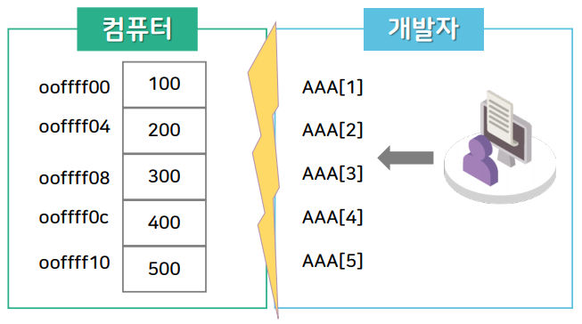
  - 일정한 차례나 간격에 따라 벌여 놓음(사전적 정의)
  - `차례`(순서)와 관련된 기본적인 자료구조 (아파트를 생각하면 이해하기 편하다.)
  - 인덱스와 원소값(`<index, value>`)의 쌍으로 구성된 집합
  - `원소의 메모리 공간 (메인 메모리, DDR)의 물리적인 위치를 '순서'적으로 결정하는 특징`
  - `배열의 순서는 메모리 공간에서 저장되는 '원소값의 물리적 순서'`

- 배열의 의미

  - '호수'(인덱스)로 표현되는 `순서`를 갖는 '아파트'(메모리 영역, 원소값을 위한 저장소)

  - 원소들이 모두 `같은 자료형`과 `같은 크기의 기억공간`을 가짐

  - 배열의 인덱스 값을 이용해서 배열의 원소값에 접근하기 때문에 직접 접근이 가능함

  - `인덱스 값은 추상화된 값 : 컴퓨터의 내부구조나 메모리 주소와 무관하게 개발자에게 개념적으로 정의됨`

  - `메모리 주소값은 실제 메모리의 물리적인 위치 값(주소 값)`

  - `인덱스`와 `주소값`의 관계(보통 배열의 인덱스는 0부터 시작)

    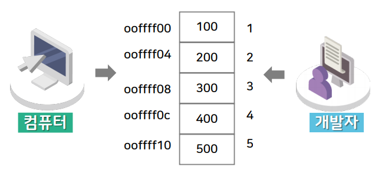

## 2. 배열의 추상 자료형

### 배열의 추상 자료형

- 추상 자료형 : 객체 및 관련된 연산의 정의
- 자료형 : 메모리 저장 할당을 위한 선언
  - int - 8bit
  - float - 16bit
  - ..... 등등
- ADT Array 객체 : 
  - < i ∈ index, e ∈ Element > 쌍들의 집합
    - Index : 순서를 나타내는 원소의 유한 집합
    - Element : 타입이 같은 원소의 집합
- ① Array create(n) ::=  배열의 크기가 n인 빈 배열을 생성하고 배열을 반환한다.
- ② Element retrieve(a, i) ::= if(i ∈ Index)
           then { 배열의 i 번쨰에 해당하는 원소값 'e'를 반환한다. }
           else { 에러메시지를 반환한다. }
- ③ Array store(a, i, e) ::= if(i ∈ Index)
           then { 배열 a의 i 번쨰 위치에 원소값 'e'를 저장하고 배열 a를 반환한다. }
           else { 인덱스 i가 배열 a의 크기를 벗어나면 에러 메시지를 반환한다. }

## 3. 배열의 연산의 구현

### 배열의 생성

```c
void create(int *a, int n) { // n = 5
    int i;
    for(i = 0; i < n, i++) {
        a[i] = 0;
    }
}
```

### 배열값의 검색 (retrieve 연산)

```c
#define array_size 5
int retrieve (int *a, int i) { // i = 2
    if(i >= 0 && i < array_size) {
        return a[i];
    } else {
        printf("Error\n");
        return (-1);
    }
}
```

### 배열 값의 검색 결과

- 다음과 같은 원소값이 저장되어 있다고 가정하며, '30'이 출력됨

  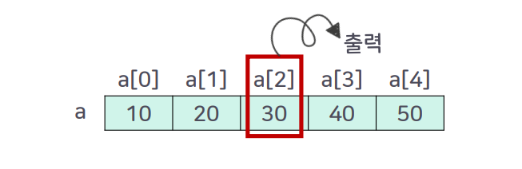

### 배열값의 저장(store 연산)

```c
#define array_size 5
void store(int *a, int i, int e) { // i = 3, e = 35
    if(i >= 0 && i < array_size) {
		a[i] = e;
    } else {
        printf("Error\n");
    }
}
```

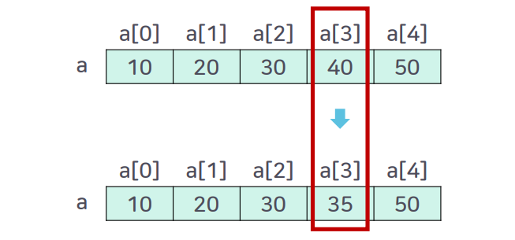

## 4. 1차원 배열 및 배열의 확장

### 1차원 배열의 정의

- 한 줄짜리 배열을 의미하며, 하나의 인덱스로 구분됨

- A[i]는 배열의 첫 번째 원소 `A[0]이 저장된 주소인 a`로 부터 시작하여, A[0]부터 A[i-1]개 까지 i개의 배열 A[]를 지나서 저장됨

- 따라서, `A[]의 시작주소를 a라고 가정하면`, A[I] 저장 주소는 `[a + i * k]`가 됨

  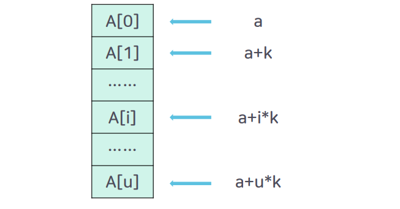

- a = 배열
- i = 인덱스
- k = 메모리 할당 단위

### 행렬의 배열 표현

- 행렬을 컴퓨터에서 표현하기에는 2차원 배열이 적합함

  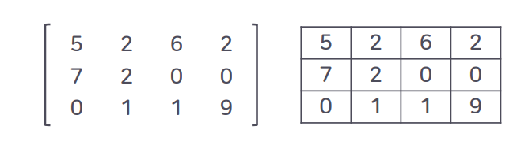

  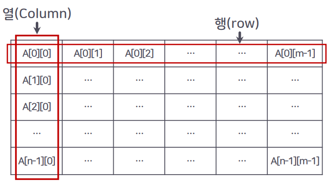

- 행 우선 배열

  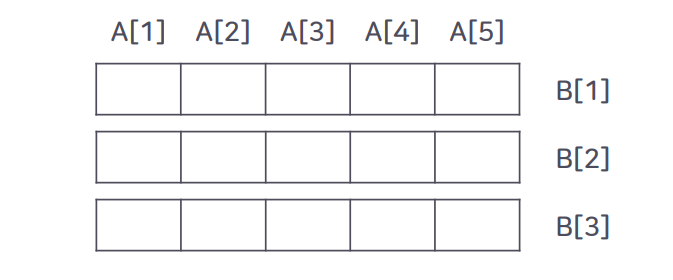

  - 행 우선 배열 

    - 가로의 1차원 배열 단위로 메모리 영역을 우선 할당함

    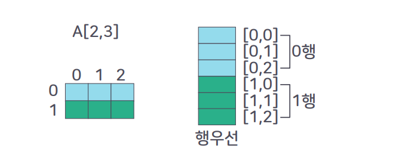

- 열 우선 배열

  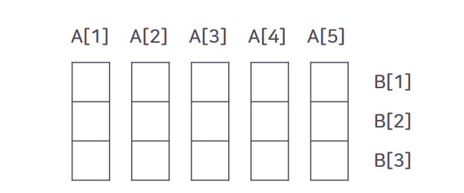

  - 열 우선 할당

    - 세로의 1차원 배열 단위로 메모리 영역을 우선 할당함

    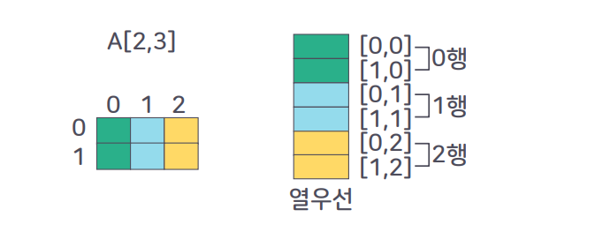

### C언어 에서의 2차원 배열(행 우선 순서 저장)

- C 언어에서 A\[5\]\[3\]을 선언하면 다음과 같은 배열이 생성됨

  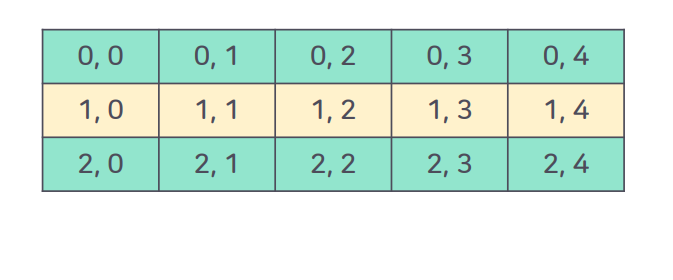

## 5. 희소행렬의 개념

### 희소 행렬

- 원소값이 0인 원소가 그렇지 않은 원소보다 상대적으로 많음

  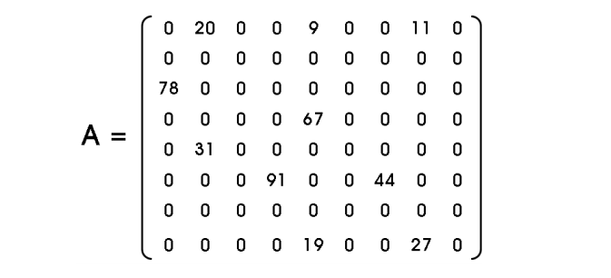

### 희소 행렬의 일반적 배열 표현

- 메모리 낭비를 막고 효율성을 높이기 위해서 0인 원소는 저장하지 않고 0이 아닌 값만을 따로 모아서 저장하는 방법이 필요함

  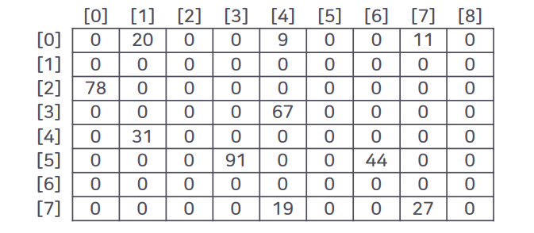

  - 희소행렬의 추상화 2번쨰

    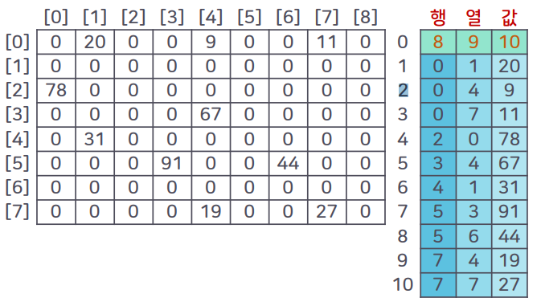

    


