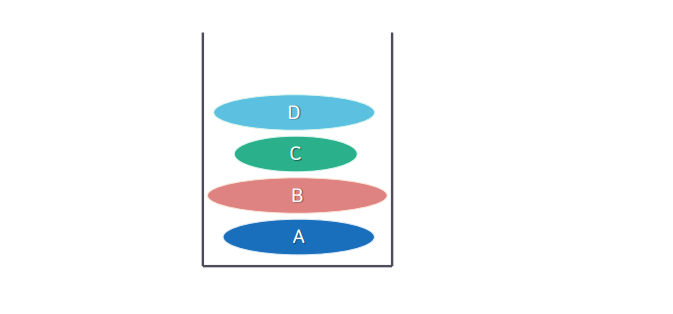
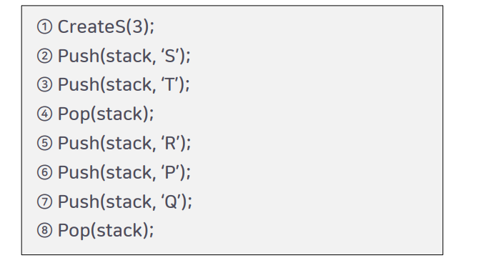
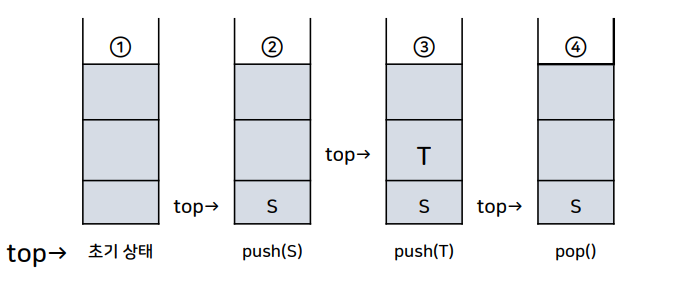
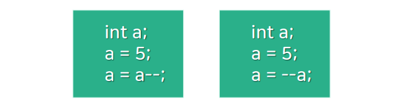

# 3강. 스택 stack

## 1. 스택의 개념과 추상 자료형

### 스택의 정의


- 위의 그림보다 조금 더 추상화된 그림



- 스택에 데이터가 들어가면 사용할 수 있는 순서는 정해져 있다.
- 스택 - `객체`와 그 `객체가 저장되는 순서를 기억`하는 방법에 관한 `추상 자료형`
  - 즉, 가장 먼저 입력된 자료가 가장 나중에 출력되는 관계를 표현함 
- 0개 이상의 `원소`를 갖는 `유한 순서 리스트`
- `push(add)`와 `pop(delete)`연산이 한곳에서 발생되는 자료구조

### 스택의 추상자료형

- CreateS 연산

  > Stack CreateS(maxStackSize) ::= 
  >
  > 스택의 크기가 maxStackSize인 빈 스택을 생성하고 반환한다

- Push 연산

  > Element Push(stack, item) ::=
  >
  > ​	if(IsFull(stack))
  >
  > ​		then { 'stackFull'을 출력한다; }
  >
  > ​		else { 스택의 가장 위에 item을 삽입하고, 스택을 반환한다; }

- Pop 연산

  > Element Pop(stack) ::=
  >
  > ​	if(IsEmpty(stack))
  >
  > ​		then { 'stackEmpty'을 출력한다; }
  >
  > ​		else {
  >
  > ​			스택의 가장 위에 있는 원소(element)를 삭제하고 반환한다;
  >
  > ​		}

- Pop/Push 연산의 실행

  

  

- 즉, 유한 순서 리스트(스택)에는 create, push, pop연산 or 함수들로만 접근할 수 있다.

## 2. 스택의 응용과 구현

### 스택의 다양한 응용

- 변수에 대한 `메모리의 할당`과 `수집`을 위한 `시스템 스택` (가비지컬렉터??? 확실치 않음. 추측)
- `서브루틴 호출 관리`를 위한 스택
- `연산자들 간의 우선순위에 의해 계산 순서가 결정되는 수식 계산`
- `인터럽트`의 처리와, 이후 리턴할 명령 수행 지점을 저장하기 위한 스택
- `컴파일러`, `순환 호출 관리(재귀 호출)`

> 함수를 실행할때 함수안에 다른 함수를 콜하는 다음 지점을 스택부분에 기억해서 
>
> 해당 콜 함수가 끝난 후 해당 지점을 실행한다.

### 스택의 삭제 연산

- 'top--'에서 사용된 '--' 연산자의 위치에 따라 연산의 적용 순서가 달라질 수 있음

  

  ```c
  a = 5;
  b = a++;
  // b = a
  // a = a + 1;
  
  b = ++a;
  // a = a + 1;
  // b = a;
  
  ```

### 스택의 생성

```c
#define STACK_SIZE 10
typedef int element;
elemnt stack[STACK_SIZE];
int top = -1;
```

### 스택의 삭제 연산

```c
element pop() {
	if(top == -1) {
		printf("Stack is Empty!!\n");
        return 0;
	} else {
        return stack[top--];
    }
}
```

### 스택의 삽입 연산

```c
void push(element item) { // 스택의 삽입 연산, item = 400
    if(top >= STACK_SIZE - 1) { // 스택이 이미 FULL인 경우
        printf("Stack is Full!!\n");
        return;
    } else {
        stack[++top] = item;
    }
}
```

## 3. 사칙 연산식의 전위/후위/중위 표현

### 수식의 계산

- 연산자의 계산순서를 생각해야 함
- A + B * C + D
  - => ((A + (B * C)) + D)

### 수식의 표기 방법

- 중위 표기법(infix notation)

  - 연산자를 피연산자 사이에 표기하는 방법
  - A+B

- 전위 표기법(prefix notation)

  - 연산자를 피연산자 앞에 표기하는 방법
  - +AB

- 후위 표기법(postfix notation)

  - 연산자를 피연산자 뒤에 표기하는 방법
  - AB+

- 중위 표기법 → 전위 표기법

  - A+B → +AB
    1. (A - ((B + K) / D ))
    2. (A - ( (+BK) / D ))
    3. (A - ( / (+BK) D ))
    4. \- A ( / (+BK) D)

- 중위 표기법 → 후위 표기법

  - A+B → AB+
    1. (A - ((B+K) / D))
    2. (A - ((BK+) / D))
    3. (A - ((BK+) D / ))
    4. A((BK+) D / )-
    5. ABK+D/- (후위 표기법)

- 중위 표기식의 후위 표기식 변환 방법

  - 먼저 중위 표기식을 연산자의 우선순위를 고려하여 (피연산자, 연산자, 피연산자)의 형태로 괄호로 묶어줌
  - 각 계산뭉치를 묶고 있는 괄호 안에서 연산자를 계산뭉치의 가장 오른쪽으로 이동시킴
  - 각 계산뭉치를 하나의 피연산자로 고려하여 위를 반복함
  - 괄호를 모두 제거함

  

  

  

  

  

  

  

  

  