# 4강. 큐


## 1. 큐의 개념 및 추상 자료형

### 큐의 정의

- 큐의 의미

  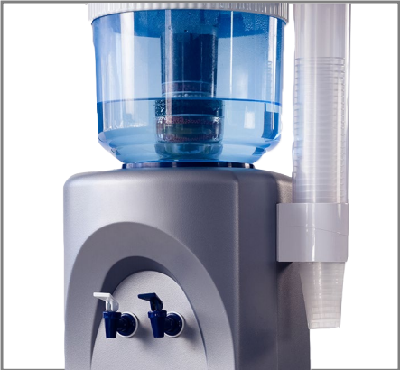

  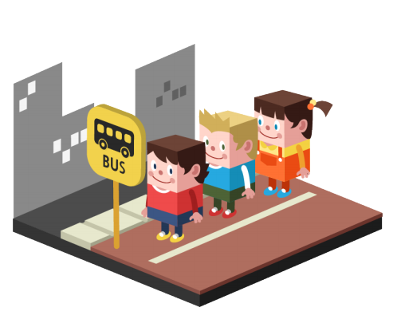

  - 스택

    

  - 큐의 의미

    - 택시를 타기 위해 서 있는 행렬
    - 병원의 접수대
    - 은행의 예금 인출기
    - 백화점의 계산대 위에 놓인 상품들
    - 작업 큐에 들어간 작업이 가장 처음에 처리되는 작업 스케줄(first-in-first-out)
      - 운영체제에서 사용되는 내용

    

    - `한쪽에서는 삽입연산만` 발생 가능하고, `다른 한쪽에서는 삭제 연산만` 발생 가능한 양쪽이 모두 터진 관
      - 데이터에 대해서 - 첨자, 인덱스값을 다른 변수로 쓰겟다는 의미
      - 즉 데이터에 접근하는 변수를 달리쓴다.
    - `한쪽에서는 삽입연산` : `서비스를 받기 위한 기다림`
    - `다른 한쪽에서는 삭제 연산` : `서비스를 받는 중`

  - 큐의 그림

    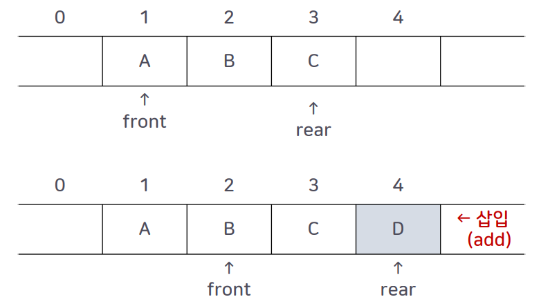

    - front 는 삭제
    - rear 는 삽입
    - front가 0이며, rear는 마지막 length - 1이다.
    - 중간 값을 빼면 에러가 난다.

- 큐의 삽입 (Add_q) 연산

  ```
  Queue Add_q(queue, item) ::=
  	if(IsFull_q(queue))
  		then { 'queueFull'을 출력한다; }
  		else { 큐의 rear에서 item을 삽입하고, `큐를 반환한다`; }
  ```

- 큐의 삭제(Delete_q) 연산

  ```
  Element Delete_q(queue) ::=
  	if(IsEmpty_q(queue))
  		then { 'queueEmpty'를 출력한다; }
  		else { 큐의 front에 있는 원소를 반환한다; }
  ```

- 빈 큐 검사(IsEmpty_q) 연산

  ```
  Boolean IsEmpty_q(queue) ::=
  	if(rear == front)
  		then { 'TRUE' 값을 반환한다; }
  		else { 'FALSE' 값을 반환한다; }
  ```

- 큐의 만원 검사(IsFull_q) 연산

  ```
  Boolean IsFull_q(queue, maxQueueSize) ::=
  	if(queue의 elements의 개수) == maxQueueSize
  		then { 'TRUE' 값을 반환한다; }
  		else { 'FALSE' 값을 반환한다; }
  ```

- Add/Delete 연산의 실행

  1. Create_q(4);
  2. Add_q(queue, 'A')
  3. Add_q(queue, 'B')
  4. Add_q(queue, 'C')
  5. Delete_q(queue);
  6. Delete_q(queue);
  7. Delete_q(queue);
  8. Add_q(queue, 'D');

  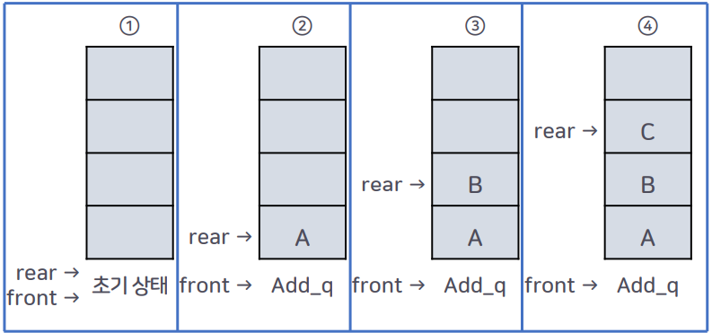

  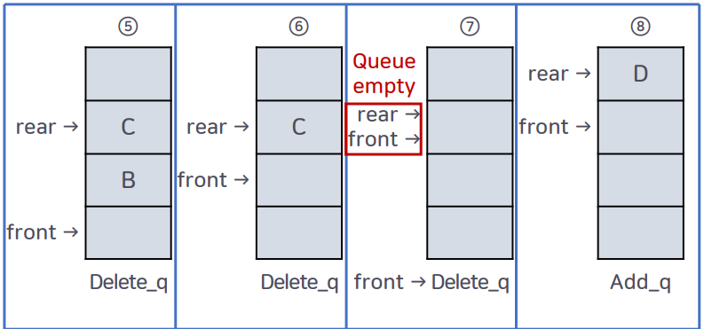

  


## 2. 큐의 응용

- CPU의 관리 방법

  - FCFS(First-Come First-Served) 스케줄링(또는 FIFO스케줄링 이라고도 함) 기법은 
    작업(프로그램)이 준비 큐에 도착한 순서대로 CPU를 할당받도록 해 주는 기법

    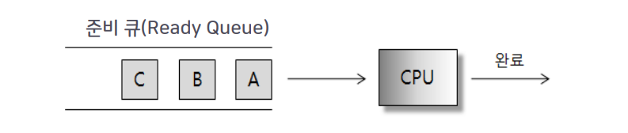

  - RR(Round Robin) 스케줄링 기법은 대화형 시스템에 사용되는 스케줄링 방식

    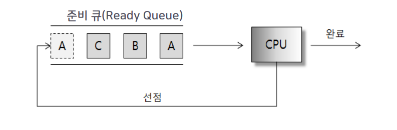

    

## 3. 배열을 이용한 큐의 구현

- 큐의 생성

  - 변수 rear의 초기값은 큐의 공백 상태를 나타내는 '-1'로 시작함

    ```c
    #define QUEUE_SIZE 5
    typedef int element;
    element queue[QUEUE_SIZE];
    	int front = -1;
    	int rear = -1;
    ```

    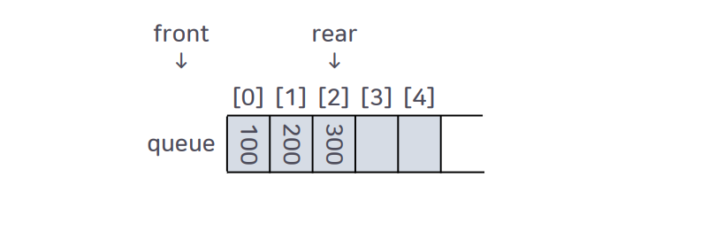

- 큐의 삽입 연산

  - 삽입 연산이 발생하면 rear 변수만 오른쪽으로 이동하고, 삭제연산이 발생하면 front 변수만 오른쪽으로 이동함

    ```c
    void Add_q(int *rear, element item) {
        if(*rear == QUEUE_SIZE - 1) {
            printf("Queue is Full !!");
            return;
        }
        queue[++(*rear)] = item;
        return;
    }
    ```

    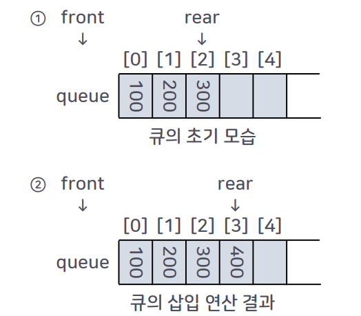

- 큐의 삭제 연산

  - 삭제 연산의 수행 결과로 삭제된 원소를 Delete_q 연산자의 호출 프로그램에게 반환해 줌

    ```c
    element Delete_q(int *front, int rear) {
        if(*front == rear) {
            printf("Queue is empty\n");
            return;
        }
        retrn (queue[++(*front)]);
    }
    ```

    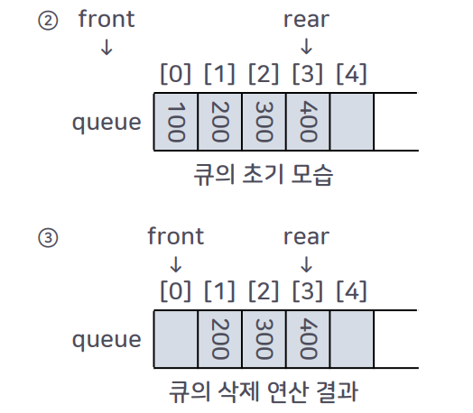

    

## 4. 원형 큐

- 큐의 빈 상태와 삽입 상태

  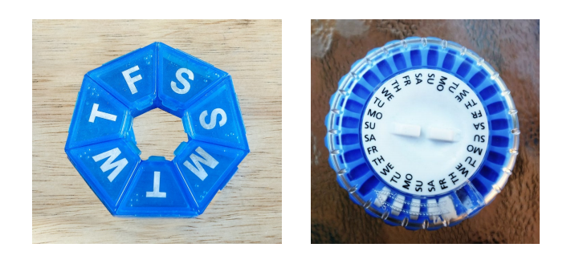

  

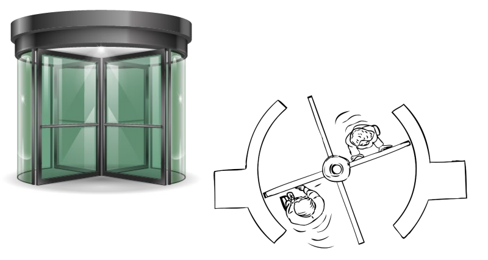

- 큐의 만원 상태

  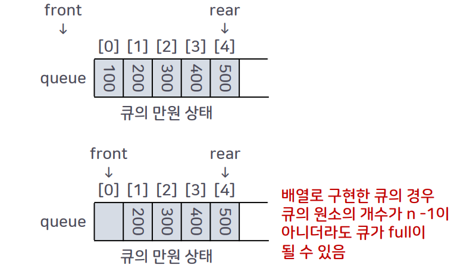
  - 배열로 구현한 큐의 경우 큐의 원소의 개수가 n - 1이 아니더라도 큐가 full이 될 수 있음

- 원형 큐의 초기 상태

  - 배열의 문제점을 해결하기 위해 원형 큐가 제안됨

  - 원형 큐는 파이프의 입구와 출구 부분을 연결시킨 형태

    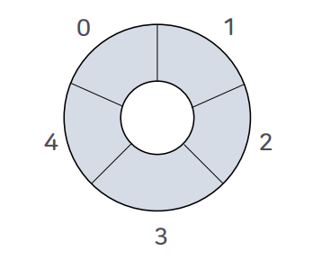

    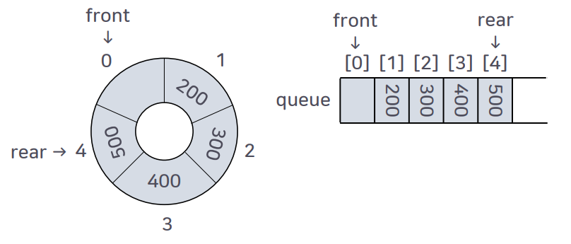

    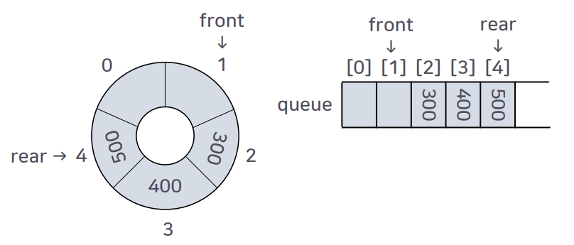

    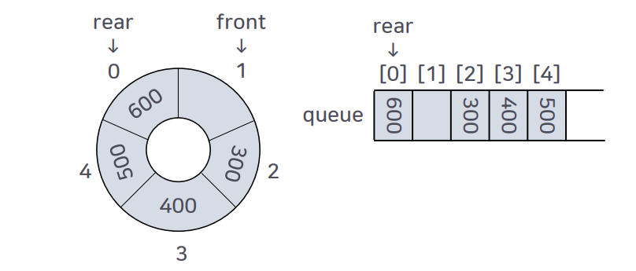

  - rear와 front의 값이 같으면 full이라고 할 수 있다.