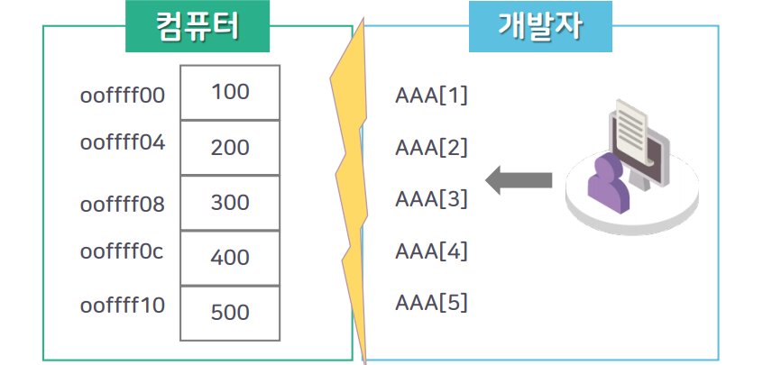
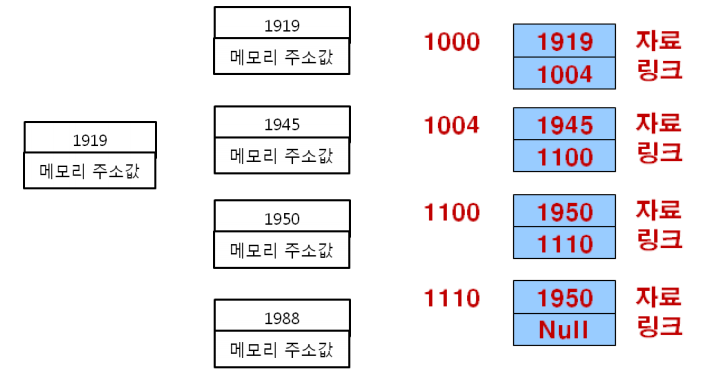
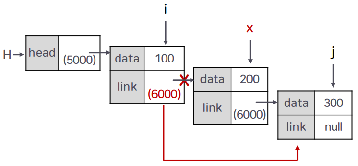

# 5강. 연결리스트


## 학습목차

1. 리스트의 개념
2. 배열을 이용한 리스트의 구현
3. 포인터를 이용한 리스트의 구현
4. 포인터 변수 및 리스트의 삭제/삽입
5. 연결리스트에서 노드의 삽입과 삭제


## 1. 리스트의 개념


### 리스트의 의미

- `일정한 순서`의 나열
- 어떤 정의에 의해서 결정된 `논리적인 순서`의 나열


### 배열




- 두번쨰 사진
  - 왼쪽이 배열의 그림
  - 오른쪽이 `리스트`의 그림

### 리스트의 의미

- 리스트의 `'순서'`는 데이터가 저장되는 물리적인 위치와 상관없이 사람들의 머릿속에 인식되는 `'논리적인 순서'`, 혹은 리스트에 나타나는 원소들 간의 `'의미적인 순서'`를 의미함

- 물품이나 사람의 이름 따위를 일정한 순서로 적어 놓은 것

  - 예) 3·1 운동(1919), 대한 독립(1945), 6.25전쟁(1950), 서울 올림픽(1988)

    

- 배열은 인덱스로 표현되는 `'순서'`가 배열 원소의 메모리 공간(주기억 장치, DDR)에서의 `물리적인 위치`를 의미함

- 하지만 `리스트의 '순서' 개념 `은 어떤 정의에 의해서 결정된 `'논리적인 순서'`임

- 원소들의 물리적인 저장 순서나 위치와는 무관하게 `원소들 간의 논리적인 순서만 유지`함

### 리스트의 구현 방법

- `포인터를 이용한` 리스트의 구현 방법 (연결 리스트)
  - 원소값을 저장하는 공간과 다음 원소를 가리키는 위치 정보를 저장하는 공간을 함께 구현하는 방법 
- `배열을 이용한` 리스트의 구현 방법


## 2. 배열을 이용한 리스트의 구현

### 배열을 이용한 리스트의 구현

- 구현해야 할 리스트를 3·1 운동(1919), 대한 독립(1945), 6.25전쟁(1950), 서울 올림픽(1988)의 순서라고 정의한다면,

- 리스트 : (1919, 1945, 1950, 1988)

  

### 배열을 이용한 리스트의 원소 삽입

- 리스트 : (1919, 1945, 1950, 1988)에 `1936년에 '애국가 작곡'을 삽입`한다면 ...

  

- 배열의 확장

  - 초기 배열 선언에서 충분히 크게 하면 어느정도는 배열의 추가 확장을 피할 수 있겠지만, 원소를 리스트의 중간에 삽입하기 위해서는 리스트의 원소값을 하나씩 뒤로 밀어야 하는 상황이 발생함

### 배열을 이요한 원소 삭제

- 리스트 (1919, 1936, 1945, 1950, 1988)에서 1936년의 애국가 작곡을 삭제하면……

  

### 배열을 이용한 리스트의 원소 삽입/삭제

- 배열로 구현된 리스트는 우너소의 순서가 연속적인 물리적 주소에 저장됨
  - 원소를 삽입하거나 삭제하기 위해서는 해당 원소의 위치 뒤에 있는 모든 원소를 뒤로 물리거나 앞으로 당겨야만 됨
  - 리스트 원소값의 이동은 원소수가 많을수록 프로그램의 수행시간을 증가시킴


### 배열을 이용한 리스트의 원소 삽입/삭제 시 발생하는 문제

- 리스트의 원소 삽입은 프로그램의 실행 중에 메모리 할당을 필요로 하는 경우도 발생시킴
- 배열을 이용한 리스트의 구현은 실제 IT 서비스 환경에서는 자주 사용되지 않고 있음
- 자료의 삽입과 삭제가 빈번히 발생하는상황에서 리스트를 배열로 구현하는 것은 빈번한 자료 이동으로 인한 비효율적인 컴퓨팅 성능을 유발함


## 3. 포인터를 이용한 리스트의 구현

### 노드의 구조

- 노드(node) 
  - 리스트의 원소(값) + 다음 원소를 가리키는 정보
- 노드는 데이터 요소(원소, 값)와 리스트의 다음 원소를 지시하는 포인터(주소, 링크(link))로 구성됨


### 노드로 표현 된 식사와 식사 정보


### 노드의 구조 및 연결




### 연결 리스트의 논리적 순서와 실제 메모리 표현


## 4. 포인터 변수 및 리스트의 삭제/삽입

### 리스트의 생성

- 정수갑 data와 링크 link로 구성된 노드의 생성

  ```c
  struct linked_list_node {
      int data;
      struct linked_list_node *link;
  };
  ```

  

### 포인터의 할당과 반환 예

```c
int a, *p_a;
float b, *p_b;
p_a = (int *)malloc(sizeof(int));
p_b = (float *)malloc(sizeof(float));
*p_a = 10;
*p_b = 3.14;
printf("a is %d, b is %f \n", *p_a, *p_b);
free(p_a);
free(p_b);
```


## 5. 연결리스트에서 노드의 삽입과 삭제

### 연결 리스트에서 노드의 삭제

- 연결 리스트의 초기 모습

  

- 연결 리스트의 노드 삭제

  

- 연결 리스트의 삭제 결과

  

- 리스트의 원소 삭제 연산 단계

  1. 삭제할 노드의 선행 노드의 링크 필드를 삭제할 노드의 후행 노드를 가리키게 한다.
  2. 삭제할 노드를 메모리에 반환한다.


### 연결 리스트에서 노드의 삽입

- 연결 리스트의 초기 모습

  

- 연결 리스트의 삽입 노드

  

- 연결 리스트의 삽입 결과

  

- 리스트의 원소 삽입 연산 단계

  1. 메모리 공간을 할당 받고 삽입할 내용을 저장하여 삽입할 x노드를 생성합니다.
  2. x 노드의 링크 부분이 후행 노드가 될 j 노드를 가리키게 합니다.
  3. 삽입될 x노드의 선행 노드가 될 i노드의 링크 필드가 x 노드를 가리키게 합니다.


### 연결 리스트의 마지막에 삽입 연산(1-1)

```c
void addNode(linkedList_h* H, int x) {
    //리스트 마지막 노드에 삽입 연산하며, x값은 100이라고 가정함
    listNode* NewNode;
    listNode* LastNode;
    NewNode = (listNode*)malloc(sizeof(listNode));
    NewNode → data = x;
    NewNode → link = NULL;
    
    if ( H → head == NULL) { // 현재 리스트가 공백인 경우
    	H → head = NewNode;
	    return;
    }
    
    // 현재 리스트가 공백이 아닌 경우 실행
    
    LastNode = H → head;
    
    while(LastNode → link != NULL) {
        LastNode = LastNode → link;
    }
    	
    LastNode → link = NewNode; 

}    
```

- NewNode의 생성


### 연결 리스트의 마지막에 삽입 연산 과정


### 리스트의 특정 노드 다음에 삽입 연산(2-1)

```c
void additNode(linkedList_h* H, listNode* prevNode, int itdata) {
    //리스트 마지막 노드에 삽입 연산하며, itdata값은 150이라고 가정함
    listNode* NewNode;
    NewNode = (listNode*)malloc(sizeof(listNode));
    NewNode → data = itdata;
    NewNode → link = NULL;
    
    NewNode → link = prevNode → link;
    prevNode → link = NewNode;
    return;
} 
```


### prevNode가 NewNode를 먼저 가리킨 모습


### NewNode의 링크 필드 값이 변경된 모습


### prevNode의 링크 필드 값이 변경된 모습


