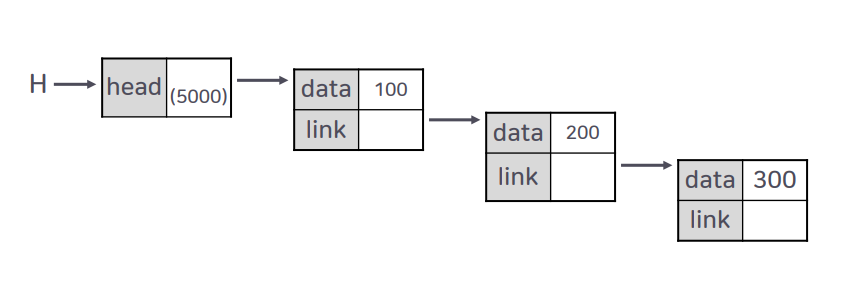
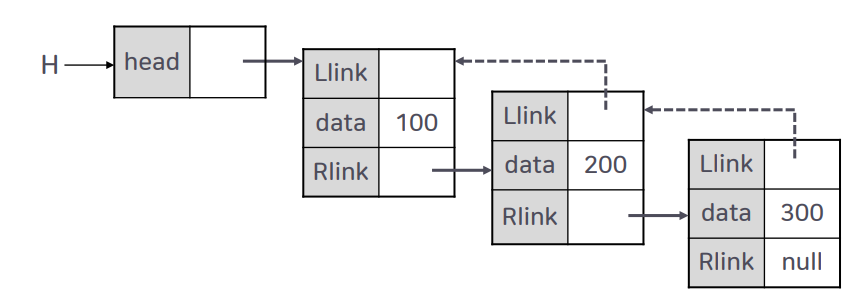
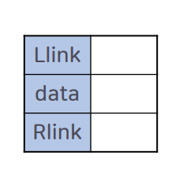

# 6강. 연결 리스트의 응용


## 학습목차

1. 연결 리스트의 변형
2. 원형 연결 리스트
3. 이중 연결 리스트


## 1. 연결 리스트의 변형

### 연결 리스트의 종류 (단순 연결 리스트)



- 단순 연결 리스트 : 하나의 링크만 있고, 각각의 노드의 링크는 후행 노드만을 가리키는 구조
  - 특정 노드의 후행 노드는 쉽게 접근할 수 있지만, 특정 노드의 선행 노드에 대한 접근은 헤드 노드부터 재검색해야 하는 문제점이 발생함


### 연결 리스트의 종류 (이중 연결 리스트)



- 이중 연결 리스트 : 특정 노드는 선행 노드를 가리키는 링크와 후행 노드를 가리키는 링크를 가짐
  - 특정 노드에서 선행 노드와 후행 노드에 간단한 프로그램 코드를 통해 접근할 수 있음


### 연결 리스트의 종류 (원형 연결 리스트)


- 연결 리스트를 살펴보면, 가장 마지막 노드의 링크 필드는 언제나 "null" 값임
  - 리스트의 마지막 원소 뒤에는 아무 원소도 없기 때문에 연결 리스트의 마지막 노드의 링크 필드는 언제나 null 값이다.
  - 그래서 마지막 노드의 링크 필드를 활용하면서도 프로그램 성능에 도움이 되도록 하기 위해서 원형 연결 리스트가 제안됨


## 2. 원형 연결 리스트

### 원형 연결 리스트

- 연결 리스트의 마지막 노드의 링크 필드를 활용하면서도 프로그램 성능에 도움이 되도록 하기 위해서 원형 연결 리스트가 제안됨


### 원형 연결 리스트의 생성

#### 정의 및 생성

```c
typedef struct ListNode { // 원형 연결 리스트의 노드 구조 정의
    int data;
    struct ListNode * link;
} listNode;

typedef struct { // 원형 연결 리스트의 헤드 노드 구조 정의
    listNode* head;
} linkedList_h;

linkedList_h* createLinkedList_h(void) { // 원형 연결 리스트의 헤드 노드 생성
    linkedList_h* H;
    H = (linkedList_h*)malloc(sizeof(linkedList_h));
    H -> head = NULL;
    return H;
}
```


### 원형 연결 리스트의 노드 삽입

#### 삽입 연산(1)

```c
void addFirstNode(linkedList_h* H, int x) {
    //원형 리스트 첫 번쨰 노드 삽입 연산, x 값은 100이라고 가정함
    listNode* tempNode;
    listNode* NewNode;
    NewNode = (listNode*)malloc(sizeof(listNode));
    NewNode -> data = x;
    NewNode -> link = NULL;
}
```


```c
void addFirstNode (linkedList_h* H, int x) {
	if (H → head == NULL) { // 현재 리스트가 공백인 경우
        H → head = NewNode;
        NewNode → link = NewNode;
        return; 
    }

    tempNode = H → head;
    while(tempNode → link != H → head) {
        tempNode = tempNode → link;
    }
    
	NewNode → link = tempNode → link;
	tempNode → link = NewNode;
	H → head = NewNode;
} 
```


#### 원형 연결 리스트의 첫 번쨰 노드 삽입의 최종 결과


### 원형 연결 리스트의 노드 삽입(2)

#### 첫 번째 노드를 가리키는 tempNode의 모습


#### 첫 번째 노드를 가리키는 tempNode 의 모습


#### 첫 번쨰 노드를 가리키는 NewNode의 모습


#### 헤드 노드가 새롭게 추가된 노드를 가리키는 모습


## 3. 이중 연결 리스트

### 단순 연결 리스트의 단점

- 어떤 노드를 찾았을 경우, 그 특정 노드의 후행 노드는 쉽게 찾을 수 있었지만, '어떤 특정 노드의 선행 노드'를 찾으려면 복잡한 방법이 필요함


#### X 노드의 선행노드를 찾는 방법 (단순 연결 리스트)


#### X 노드의 선행노드를 찾는 방법 (이중 연결 리스트)


### 원형 이중 연결 리스트


### 이중 연결 리스트의 노드 구조

- 양쪽 방향으로 순회할 수 있도록 링크 필드가 두개 필요함 => 시작점(head)도 두개의 링크가 필요

- 이중 연결 리스트의 노드 구조 : 두 개의 링크 필드와 한 개의 데이터 필드

  

  

### 이중 연결 리스트의 정의 및 생성

#### 초기화

```c
typedef struct ListNode {
    // 이중 연결 리스트의 노드 구조 정의
    struct ListNode* Llink;
    int data;
    struct ListNode* Rlink;
} listNode;

typedef struct { // 이중 연결 리스트의 헤드 노드 구조 정의
    listNode* Lhead;
    listNode* Fhead;
} linkedList_h;
```


### 이중 연결 리스트의 노드 삽입

#### 삽입 연산

```c
void addDNode(linkedList_h* H, listNode* prevNode, int x) {
    //이중 연결 리스트 노드 삽입 연산, x값은 200이라고 가정함
    listNode* NewNode;
    NewNode = (listNode*)malloc(sizeof(listNode));
    NewNode → Llink = NULL;
    NewNode → data = x;
    NewNode → Rlink = NULL;
    NewNode → Rlink = prevNode → Rlink;
    prevNode → Rlink = NewNode;
    NewNode → Llink = prevNode;
    NewNode → Rlink → Llink = NewNode; 
} 
```


#### 초기 모습


#### 삽입될 노드


#### 포인터 연결 단계(1)


#### 포인터 연결 단계(2)


#### 포인터 연결 단계(3)


#### 포인터 연결 단계(4)


#### 포인터 연결 단계(5) : 결과


### 이중 연결 리스트의 노드 삭제

```c
void deleteDNode(linkedList_h* H, listNode* delNode) {
    // 이중 연결 리스트에서 데이터의 값이 300인 노드(delNode)를 삭제하는 연산
    delNode → Llink → Rlink = delNode → Rlink;
    delNode → Rlink → Llink = delNode → Llink;
    free(delNode);
}
```


#### 초기 모습


#### 포인터 삭제 단계(1)


#### 포인터 삭제 단계(2)


#### 포인터 삭제 단계(3)


