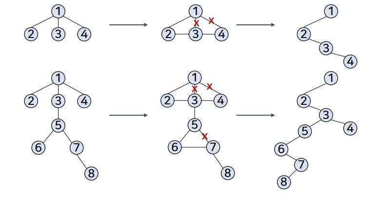

# 7강. 트리

## 1. 트리

## 2. 용어와 논리적 표현 방법

### 트리의 구성

- 노드 : 트리의 항목 / 트리에 저장되는 데이터의 묶음
- 부모노드 - 자식노드 : 상하 계층구조가 있고 직접적으로 연결된 노드로서 상위계층의 부모 노드와 하위 계층의 자식 노드

- 루트노드 : 트리의 최상위 노드(부모가 없는 노드)

- 서브트리 : 부모 노드를 삭제하면 생기는 트리들

- 리프노드 : 트리의 맨 끝(바닥)에 있으면서, 자신의 서브트리를 갖지 않는 노드

  

### 트리의 다른모습들

### 진입 / 진출 차수

- 루트노드 진입 차수 = 0
- 루트를 제외한 모든 노드의 진입 차수 = 1
- 리프노드 진출 차수 = 0
  - 진입 차수는 `부모`를 뜻한다.
  - 진출 차수는 `자식`을 뜻한다.

### 트리의 레벨

- 노드의 레벨 : 루트로부터 그 노드까지 이어진 선(경로)의 길이

### 트리의 높이

- 트리의 높이 : 루트로부터 가장 멀리 있는 노드까지 이어진 선(경로)의 길이에 1을 더한 값

  

  

### 트리의 다른 표현

## 3. 이진 트리

### 이진 트리의 정의

- 모든 노드의 차수가 2 이하인 트리

- 수학적으로 이진트리의 구성에 관한 이론을 정리하기 쉽고, 컴퓨터 내부에서 구현하기도 효율적임

- 모든 노드가 2개 이하의 자식 노드를 가지므로 일반성을 잃지않고 '오른쪽', '왼쪽'이라는 방향 개념을 부여할 수 도 있음

  - 오른쪽 노드, 왼쪽 노드의 개념적 접근도 있음

  

  - 좌측 트리는 이진트리 이다.
  - 우측 트리는 이진트리가 아니다

### 포화 이진 트리

- 이진 트리의 각 레벨에서 허용되는 최대 개수 노드를 가지는 트리

  

  

  

  - 리프노드를 제외한 모든 레벨에서 모든 노드들이 2개씩의 자식노드를 가지는 트리를 포화이진트리 라고 말할 수 있다.

    

### 완전 이진 트리

- 높이가 k인 이진 트리가 '0 레벨'부터 'k-2레벨'까지 다 채우고, 마지막 'k-1레벨'에서 왼쪽부터 오른쪽으로 노드들이 차례로 채워진 이진 트리

  

  

## 4. 이진 트리의 구현

### 배열을 이용한 이진 트리의 구현

- 트리가 완전 이진 트리 또는 포화 이진트리인 경우 낭비되는 공간이 없어 효율적임

  

  ​	

  ​	

  ​	

  

-  트리가 깊어질수록 기억장소 낭비가 2의 거듭제곱에 비례하며 낭비가 심해짐

  

  

### 포인터를 이용한 이진 트리의 구현

- 포인터를 이용한 이진 트리의 노드 생성

  

  

## 5. 이진 트리 연산

### 이진 트리의 순회

- 이진 트리의 각 노드를 (빠짐없이 그리고 중복없이) 한 번씩 방문하는 것

  

### 이진 트리의 전위 순회

- 루트노드 - 왼쪽 자식 노드 - 오른쪽 자식 노드

  

  

  

### 이진 트리의 후위 순회

- 왼쪽 자식노드 - 오른쪽 자식 노드 - 루트 노드

  

  

  

### 이진 트리의 중위 순회

- 왼쪽 자식노드 - 루트노드 - 오른쪽 자식노드

  

  

  

### 이진 트리의 순회

- 이진 트리의 순회 단위
  1. 루트 방문 (P)
  2. 왼쪽 서브트리 순회 (L)
  3. 오른쪽 서브트리 순회 (R)

### 이진 트리의 순회 알고리즘

- 전위 순회 (PLR)

  

- 중회 순회 (LPR)

  

- 후위 순회 (LRP)

  

### 이진 트리의 생성/삽입/삭제

- 일반적인 이진 트리를 생성하는 것은 연결 리스트 연산을 사용함
- 첫 노드를 생성하면 루트 노드가 되고, 새로운 노드를 추가하려면 연결 리스트의 삽입 연산을 사용함
- 노드를 삭제할 때, 삭제하려는 노드가 리프노드인 경우는 해당 노드를 가리키는 포인터를 null로 지정하면 됨
- 리프노드가 아닌 경우에는 삭제하려는 노드의 자식 노드에 대한 처리를 추가로 해주어야 함

### 이진 트리의 삽입

### 이진 트리의 삭제

### 이진 트리의 노드 개수 세는 연산

### 이진 트리의 리프 노드 개수 세는 연산

## 6. 일반 트리를 이진 트리로 변환

### 이진 트리로 변환 방법

- 일반 트리에 대하여 각 노드의 형제들을 연결
  - 각 노드에 대하여 가장 왼쪽 링크만 남기고 모두 제거
- 루트노드는 반드시 왼쪽 자식노드 하나만 갖도록 함

\

